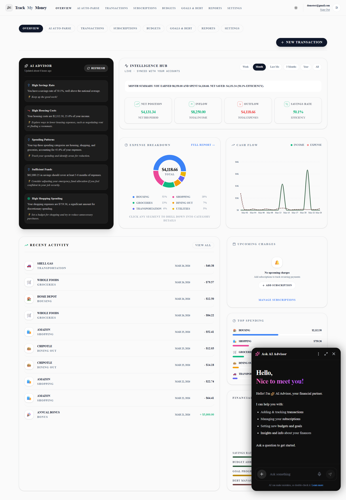
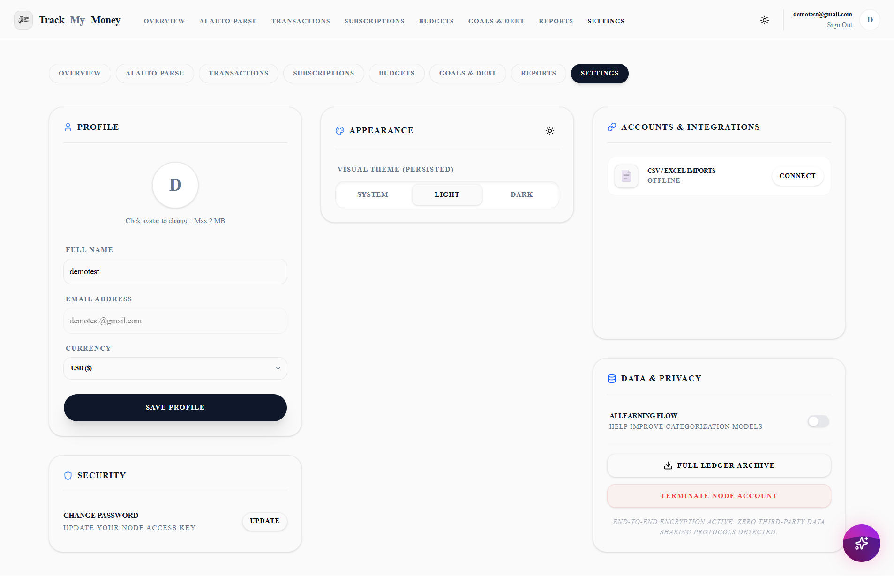
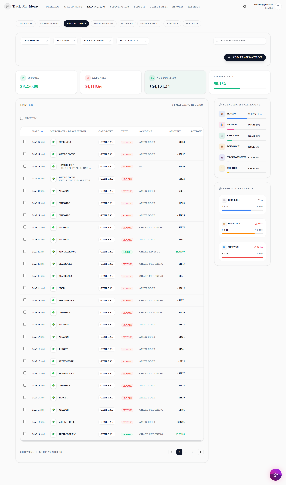
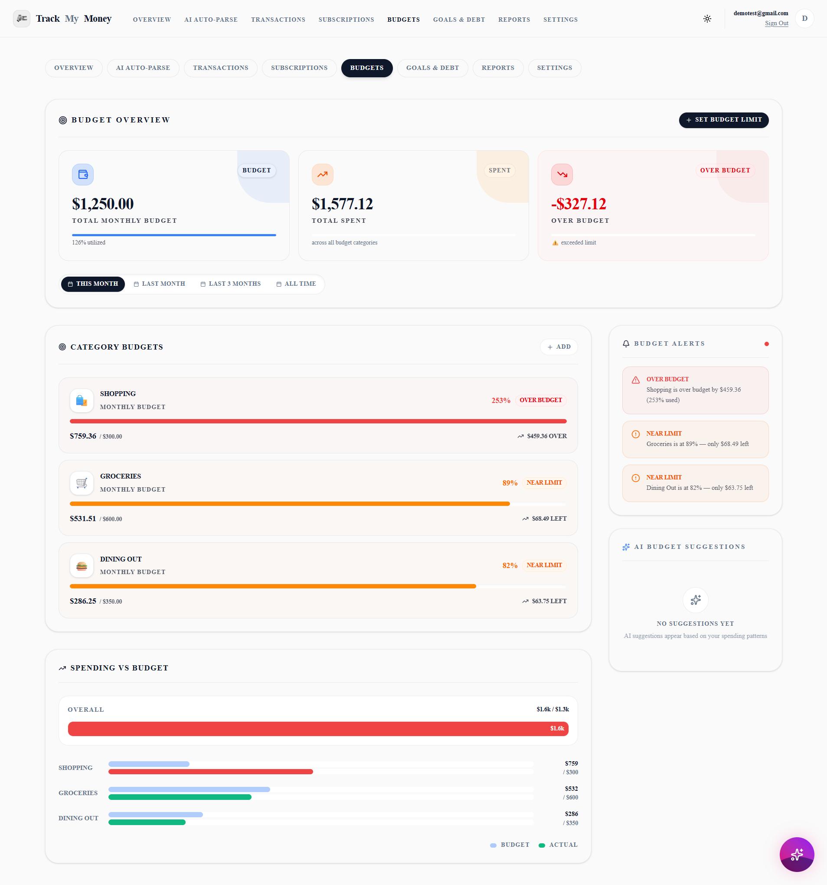
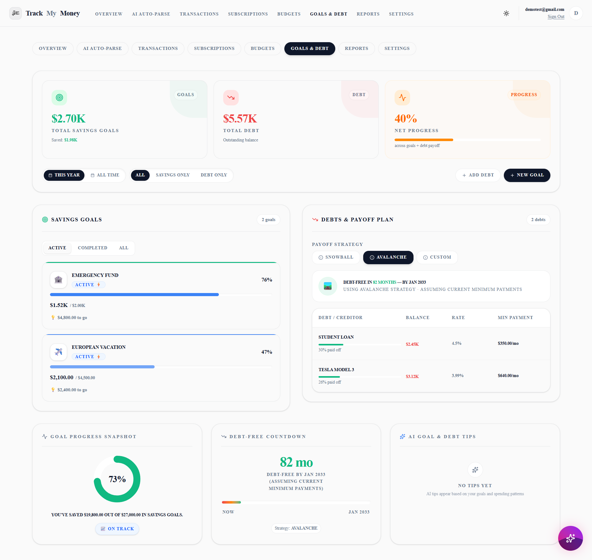
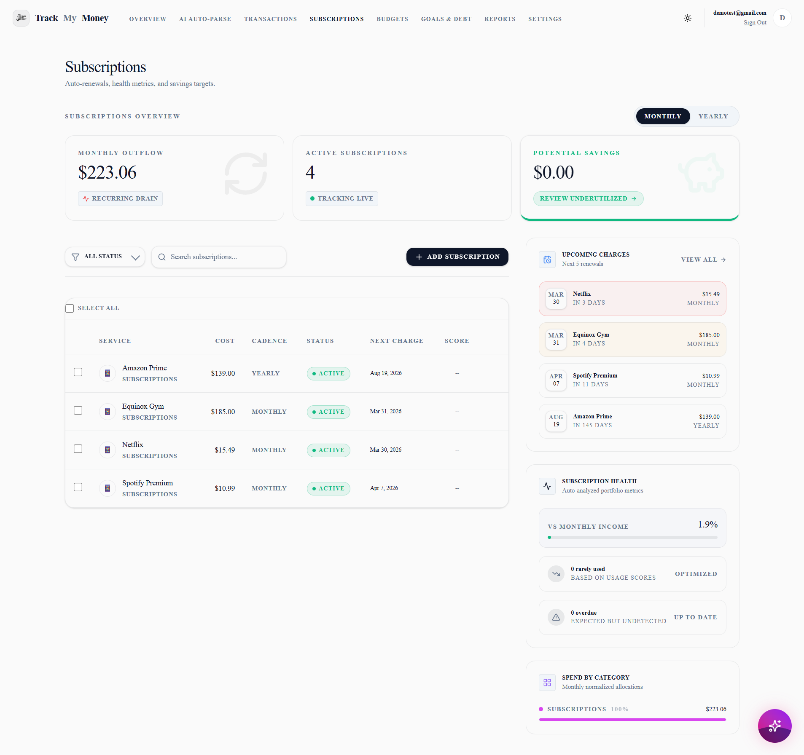
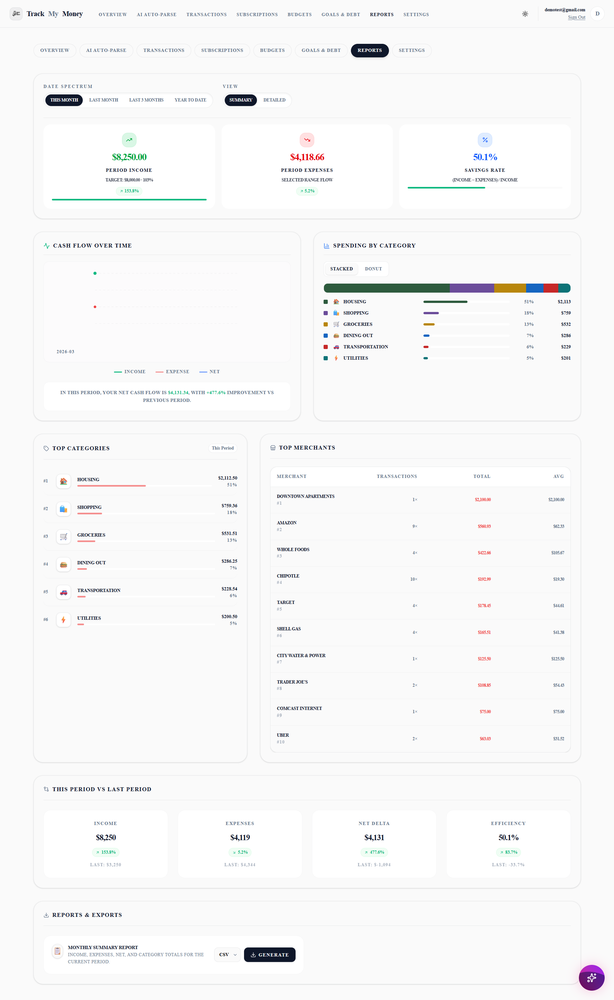
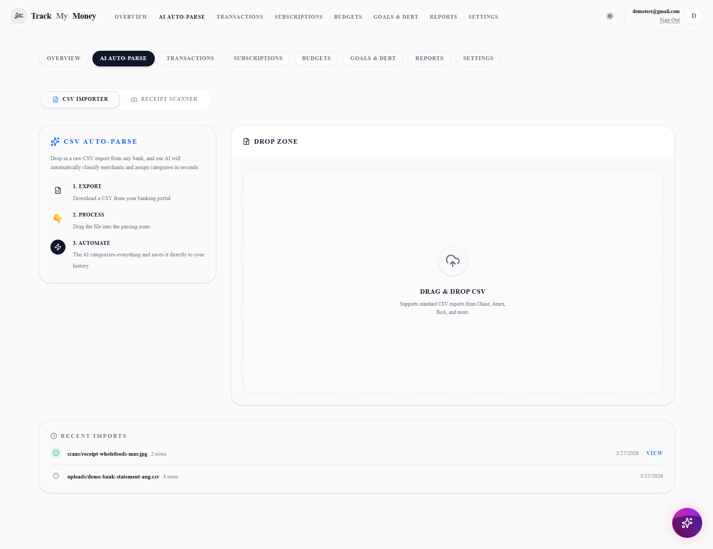
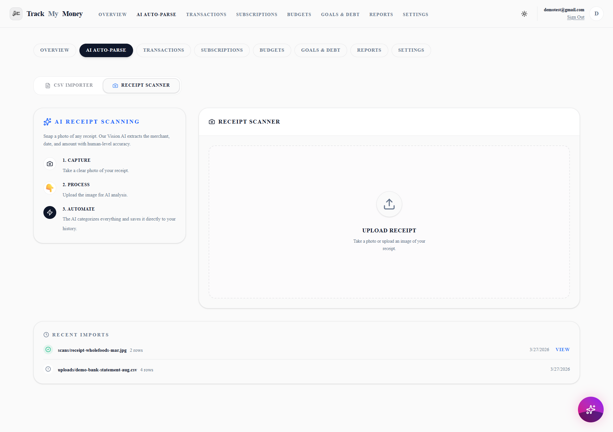

# TrackMyMoney

<div align="center">
  
</div>

TrackMyMoney is an AI-assisted personal finance website designed to turn scattered financial activity into a clear, usable operating system for everyday money management. Instead of forcing users to live inside spreadsheets, it combines transaction tracking, budgeting, goals, debt visibility, subscription monitoring, reporting, and AI-powered import workflows in one product.

Built on Next.js, Supabase, Drizzle, and modern AI tooling, the product is structured around one idea: make financial clarity feel fast, visual, and low-friction.

## Product overview

TrackMyMoney is not just a transaction log. It is a full personal finance workspace with a modern dashboard layer, secure user-scoped data access, and AI-supported workflows for importing and organizing financial records.

The website is built around these core jobs:

- help users understand where money is going
- make recurring spending visible
- keep budget limits actionable
- turn savings goals into trackable progress
- surface debt obligations clearly
- reduce manual entry through AI-assisted parsing
- keep data portable with export tools

## Core website experience

### 1. Marketing and acquisition experience

The public-facing website includes a dedicated landing experience with:

- a value-driven hero section
- problem-to-outcome storytelling
- a three-step "how it works" flow
- product feature highlights
- trust and security messaging
- FAQ and conversion-focused call-to-action sections

This makes the website function as both a product and a clear commercial presentation of the product.

### 2. Authentication flow

TrackMyMoney includes a complete auth layer for:

- login
- signup
- forgot password
- password update

Authentication is handled with Supabase Auth and is integrated into the protected dashboard experience.

### 3. Dashboard application

Once signed in, users move into the main application, which is organized into focused dashboard sections:

- Overview
- Transactions
- Budgets
- Goals
- Subscriptions
- Reports
- Auto-Parse
- Settings

This structure keeps the website easy to navigate while still supporting a broad set of finance workflows.

### Account Settings
<div align="center">
  
</div>

## Main feature set

### Overview dashboard


The overview area is the command center of the product. It is designed to give users an immediate sense of financial health through metrics, summaries, and visual analytics. This includes:

- cash flow visibility
- spending trend analysis
- category-level breakdowns
- savings and health-style indicators
- quick actions for common finance tasks

### Transactions


The transaction system is the core financial ledger of the website. It supports:

- manual transaction creation
- editing and deletion workflows
- filters and drill-down views
- category assignment
- merchant and description tracking
- source-aware transaction data
- recurring and subscription-linked transaction states

The schema is designed to support both manually created records and AI/import-generated records in the same product flow.

### Budgets


The budgeting area focuses on category-level spending control rather than a generic spreadsheet-style experience. It supports:

- budget creation by category
- period-based budgeting
- spending vs limit tracking
- budget adherence visibility
- higher-level budget summaries for fast review

### Goals and debts


TrackMyMoney treats goals and debts as first-class planning objects instead of side notes. The product includes:

- savings goal tracking
- progress against target amounts
- debt balance visibility
- repayment-related fields such as interest and minimum payment
- summary views that connect goals and debt health together

This makes the website useful for both offensive planning (saving) and defensive planning (paying down liabilities).

### Subscription monitoring


Subscription tracking is built into the core product rather than added as a separate tool. The system supports:

- subscription records linked to user accounts and categories
- recurring interval tracking
- upcoming charge visibility
- status states such as active, paused, and cancelled
- usage and potential savings signals

This helps users identify silent recurring costs and reduce unnecessary spend.

### Reports and exports


The reports area turns raw financial activity into shareable output. The website supports:

- structured reporting views
- report generation
- transaction exports
- user data export workflows
- downloadable formats for external use

This is important for freelancers, operators, and users who still need portable records outside the app.

### AI-assisted auto-parse



One of the strongest product differentiators is the auto-parse workflow. The website includes AI-supported handling for:

- statement import jobs
- parsed row review
- transaction categorization
- merchant extraction
- confidence scoring
- receipt OCR
- import commit flows

The design here is practical: AI helps with extraction and organization, but the application still keeps user review and structured data storage at the center.

### AI insights and advisory flows

TrackMyMoney also includes AI-backed advisory features such as:

- generated financial insights
- chat-style assistance
- category suggestion workflows
- advisor-oriented financial guidance based on user data context

These features extend the website from passive tracking into guided interpretation.

## Data model and domain design

The database structure reflects a serious finance product rather than a basic CRUD demo. Core entities include:

- profiles
- accounts
- categories
- transactions
- budgets
- goals
- debts
- subscriptions
- subscription events
- health snapshots
- chat messages
- AI insights
- import jobs
- import rows

This model allows the website to connect transactional data, planning tools, recurring spend, and AI-generated workflows in a consistent system.

## Security and privacy approach

TrackMyMoney is built around user-scoped financial data, so the architecture leans heavily on secure-by-default patterns.

Security characteristics of the website include:

- Supabase Auth for user identity
- row-level data protections for user-owned records
- protected dashboard routes
- controlled server-side elevated access for admin-only cases
- export and account-management support aligned with user ownership
- HTTPS-oriented deployment on modern hosting infrastructure

The security messaging on the public site is also aligned with the actual implementation direction of the application.

## Technical architecture

TrackMyMoney is built with:

- Next.js 16 App Router
- React 19
- Supabase
- Postgres
- Drizzle ORM
- Tailwind CSS 4
- Recharts
- Framer Motion
- OpenAI-compatible AI integrations
- Groq-powered AI routes

The architecture combines a modern React frontend with server-rendered and API-driven workflows, while keeping the product modular by dashboard section.

## Why this website stands out

What makes TrackMyMoney stronger than a typical finance dashboard clone is the way it connects several layers into one coherent product:

- a polished public website
- a real authenticated application
- a structured financial domain model
- AI-assisted import and categorization
- practical export and ownership features
- clear separation of product areas inside the dashboard

It is positioned more like a personal finance operating system than a simple expense tracker.

## Ideal positioning

TrackMyMoney is especially well suited for:

- users who want a modern alternative to spreadsheets
- freelancers who need cleaner money visibility
- people trying to control recurring spend
- users actively managing savings and debt
- users who want AI to reduce data-entry friction without losing control of their records

## Minimal developer notes

For developers working on the project, the core scripts are:

```bash
npm run dev
npm run build
npm run start
npm run lint
```

Main environment variables used by the application include:

```env
NEXT_PUBLIC_SUPABASE_URL=
NEXT_PUBLIC_SUPABASE_ANON_KEY=
SUPABASE_SERVICE_ROLE_KEY=
DATABASE_URL=
NEXT_PUBLIC_SITE_URL=
GROQ_API_KEY=
AI_API_KEY=
AI_BASE_URL=
AI_MODEL=
CRON_SECRET=
```

## Summary

TrackMyMoney is a full-stack finance product that combines modern UI, structured personal finance workflows, secure data handling, and AI-assisted automation into one cohesive website. The product is broad enough to feel complete, but organized enough that each area still has a clear responsibility.
