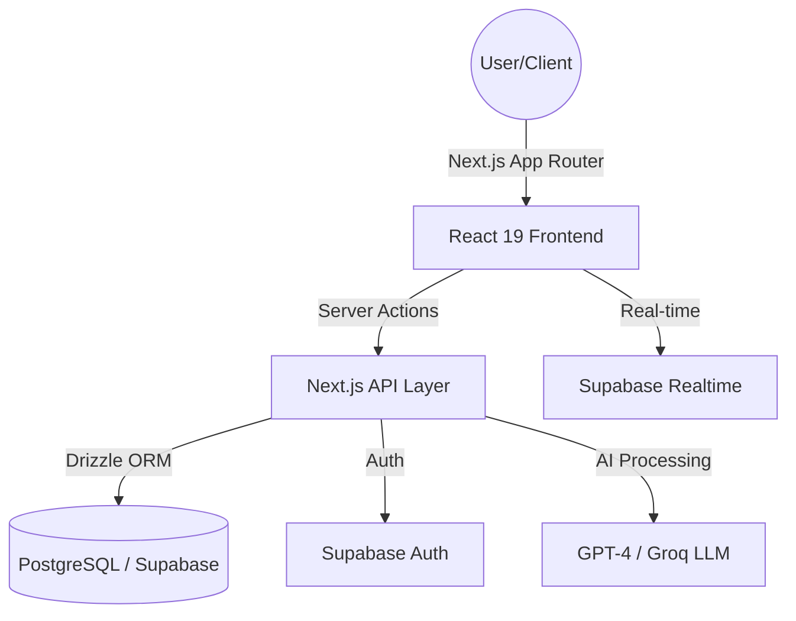

# TrackMyMoney: AI-Powered Financial Operating System 💰


[](https://nextjs.org/)
[](https://react.dev/)
[](https://supabase.com/)
[](https://orm.drizzle.team/)
[](https://tailwindcss.com/)
[](https://opensource.org/licenses/MIT)

**TrackMyMoney** is a production-grade, AI-assisted personal finance suite designed to transform scattered financial data into a clear, actionable operating system. Built with the **Next.js 15 App Router** and **React 19**, it combines high-performance transaction tracking, intelligent budgeting, and AI-powered advisory into a single, cohesive experience.

---

## 🌟 Elite Feature Set

- **🤖 AI Auto-Parse:** Intelligent receipt OCR and bank statement parsing powered by GPT-4 and Groq.
- **📊 Dynamic Analytics:** Real-time financial health snapshots and spending trend visualizations using Recharts.
- **💸 Subscription Sentinel:** Automated monitoring of recurring charges with "Savings Signals" to identify unnecessary spend.
- **🎯 Goal & Debt Engine:** First-class treatment of savings targets and debt repayment strategies with interest tracking.
- **🛡️ Secure-by-Design:** Enterprise-grade security with Supabase Auth and Row-Level Security (RLS) for absolute data privacy.

---

## 🏗️ Technical Architecture

TrackMyMoney leverages a modern, server-centric architecture for maximum security and performance.



---

## 🚀 Quick Start (Developer Setup)

1.  **Clone & Install:**
    ```bash
    git clone https://github.com/xsourabhsharma/trackmymoney.git
    cd trackmymoney
    npm install
    ```

2.  **Environment Configuration:**
    Create a `.env.local` file with the following keys:
    ```env
    NEXT_PUBLIC_SUPABASE_URL=your_url
    NEXT_PUBLIC_SUPABASE_ANON_KEY=your_key
    SUPABASE_SERVICE_ROLE_KEY=your_key
    DATABASE_URL=your_db_url
    AI_API_KEY=your_openai_key
    GROQ_API_KEY=your_groq_key
    ```

3.  **Run Development Server:**
    ```bash
    npm run dev
    ```

---

## AI, MCP, And CLI Access

TrackMyMoney exposes a user-scoped MCP and CLI layer for AI assistants and local automation.

1. Open **Dashboard -> Settings -> AI, MCP & CLI Access**.
2. Generate a scoped external access token. The token is shown once and stored only as a hash.
3. Use one of the generated snippets:
   - Remote MCP: connect clients that support Streamable HTTP to `/api/mcp` with `Authorization: Bearer <token>`.
   - Stdio bridge: use `npx -y mcp-remote https://your-domain.com/api/mcp` with the same bearer header.
   - CLI: run `trackmymoney --base-url https://your-domain.com --token <token> transaction add ...`.

All create, update, and delete tools are confirmation-gated. The first call returns a preview and `confirmationId`; execution only happens after a second call with `confirm=true` and the matching ID. The website AI widget uses the same tool layer.

---

## 🛡️ Data Domain Model

The schema is engineered for complex financial relationships, not just basic CRUD:

| Entity | Responsibility |
| :--- | :--- |
| **Transactions** | Unified ledger for manual and AI-parsed records |
| **Budgets** | Period-based category-level spending control |
| **Subscriptions** | Recurring event tracking with status lifecycle |
| **Goals/Debts** | Planning objects for savings and liabilities |
| **AI Insights** | Contextual advisory reports generated from data |

---

## 📈 Performance & Tech Stack

- **Framework:** Next.js 15 (App Router) + React 19
- **Database:** PostgreSQL via Supabase
- **ORM:** Drizzle ORM (Type-safe SQL)
- **Styling:** Tailwind CSS 4 + Framer Motion
- **AI:** OpenAI GPT-4o + Groq Llama 3

---

## 📜 License
This project is licensed under the **MIT License**.

---
*Maintained with 🧡 by [xsourabhsharma](https://github.com/xsourabhsharma)*
